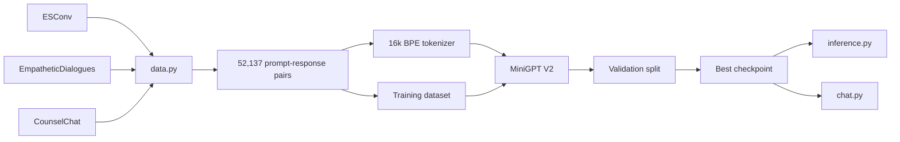

<div align="center">

# Emotional Support MiniGPT V2


<br />


<br />
<br />

> A student-built MiniGPT emotional-support chatbot that moved from an interesting V1 prototype to a genuine V2 conversational model.

</div>

---

## Final V2 Assessment

**V1 was an interesting prototype. V2 is a genuine emotional-support chatbot.**

It is not therapist quality. It is not ChatGPT quality. But for a small custom MiniGPT trained locally with around 52k examples, V2 is clearly beyond a toy project.

```text
V1 -> 4/10
V2 -> 7.5/10
Possible V3 -> 8.5/10
```

---

## Biggest Achievement

The biggest achievement is not only the loss, the architecture, or the tokenizer.

It is this response:

```text
You: oh no I had a breakup

Bot: That sounds like a really hard time.
```

That single response shows the model learned the core emotional-support pattern:

```text
negative event -> empathy -> supportive language
```

For a small MiniGPT model trained on a MacBook, that is a very respectable V2 result.

---

## V1 vs V2 Dataset

| Version | Dataset Sources | Training Pairs |
| --- | --- | ---: |
| V1 | ESConv only | 12,759 |
| V2 | ESConv | 12,759 |
| V2 | EmpatheticDialogues | 36,629 |
| V2 | CounselChat | 2,749 |
| **V2 Total** | **3 emotional-support sources** | **52,137** |

### Result

- Around **4x more training data** than V1.
- Much broader emotional coverage.
- Better exposure to different support styles, situations, and user emotions.

---

## Tokenizer Upgrade

| Version | Vocabulary Size | Impact |
| --- | ---: | --- |
| V1 | 8,000 | Smaller vocabulary, more token fragmentation |
| V2 | 16,000 | Better English and better emotional vocabulary |

### Result

- Better handling of emotional words.
- Less token fragmentation.
- Smoother response generation.
- Stronger foundation for fluency improvements.

---

## Model Upgrades

V2 moves closer to modern LLM design by adding:

| Upgrade | Why It Matters |
| --- | --- |
| RMSNorm | More stable normalization for transformer training |
| SwiGLU | Stronger feed-forward block than a basic MLP |
| Weight tying | Shares input/output embeddings for efficiency |
| Better initialization | Helps training stability |
| BOS support | Cleaner sequence starts |
| EOS support | Cleaner sequence endings |

### Result

V2 is much closer to a modern GPT-style architecture while still staying small enough to train locally.

---

## Training Pipeline Upgrade

V1 was closer to:

```text
train and pray
```

V2 is closer to:

```text
train -> validate -> checkpoint -> compare -> improve
```

### Added In V2

| Training Feature | Benefit |
| --- | --- |
| Validation split | Measures whether the model actually improves |
| Best checkpoint saving | Keeps the strongest model automatically |
| Gradient clipping | Reduces unstable updates |
| Scheduler | Improves learning-rate control |
| Improved checkpoints | Makes experiments easier to compare |

### Result

You now know whether the model improved instead of only hoping the training loss went down.

---

## V2 Performance Scores

<div align="center">

| Category | Score | Progress |
| --- | ---: | --- |
| Architecture | 8.5/10 | ████████░░ |
| Data Pipeline | 9/10 | █████████░ |
| Training Pipeline | 9/10 | █████████░ |
| English Fluency | 7/10 | ███████░░░ |
| Emotional Recognition | 8.5/10 | ████████░░ |
| Emotional Support Quality | 7/10 | ███████░░░ |
| Multi-Turn Conversation | 5.5/10 | ██████░░░░ |
| Prompt Following | 8.5/10 | ████████░░ |
| **Overall V2** | **7.5/10** | **████████░░** |

</div>

---

## What V2 Does Well

### Emotional Recognition

The model clearly distinguishes different emotional situations:

| User Situation | Model Behavior |
| --- | --- |
| Exam failure | Responds with sympathy |
| Breakup | Recognizes sadness |
| Happy event | Responds positively |

Example patterns:

```text
Exam failure -> "I'm sorry to hear that"
Breakup      -> "That is very sad"
Happy        -> "Good job"
```

### Emotional Support Quality

Best example:

```text
That sounds like a really hard time.
```

That is exactly the kind of short, validating, supportive response the model was meant to learn.

### Prompt Following

Prompt-copying is largely fixed in V2. The model now follows the emotional-support prompt format more cleanly and generates the assistant response instead of repeating the prompt.

---

## Current Weakest Area

### Multi-Turn Conversation: `5.5/10`

This is the main weakness in V2.

The model can generate good single-turn supportive responses, but it still loses context sometimes in longer conversations. V3 should focus on longer context, stronger dialogue memory, and better multi-turn consistency.

---

## Architecture Flow



---

## Project Structure

```text
MiniGPT-Emotional-Support/
├── chat.py                 # Interactive terminal chatbot
├── data.py                 # Builds V2 multi-source training pairs
├── dataset.py              # PyTorch dataset with prompt/label masking
├── inference.py            # Single-prompt generation demo
├── model.py                # MiniGPT V2 transformer architecture
├── tokenizer.py            # Trains and saves the 16k BPE tokenizer
├── tokenizer.json          # Trained tokenizer file
├── requirements.txt        # Python dependencies
├── data/
│   ├── train_pairs.json    # Combined training samples
│   ├── tokenizer_corpus.txt
│   └── corpus.txt
├── checkpoints/            # Current model checkpoints
└── checkpoints_v1/         # Earlier V1 checkpoint set
```

---

## Quick Start

Clone the repository:

```bash
git clone https://github.com/MaheshReddy-ML/MiniGPT-Emotional-Support
cd MiniGPT-Emotional-Support
```

Install dependencies:

```bash
pip install -r requirements.txt
```

Prepare the dataset:

```bash
python data.py
```

Train the tokenizer:

```bash
python tokenizer.py
```

Train the model:

```bash
python train.py
```

Run single-prompt inference:

```bash
python inference.py
```

Start interactive chat:

```bash
python chat.py
```

> On Apple Silicon, the scripts automatically use `mps` when available. Otherwise, they fall back to CPU.

---

## Example Chat

```text
You: oh no I had a breakup

Bot: That sounds like a really hard time.
```

Another expected style:

```text
You: I failed my exam and I feel terrible.

Bot: I'm sorry to hear that.
```

---

## V1 vs V2 Summary

| Area | V1 | V2 |
| --- | --- | --- |
| Dataset | ESConv only, 12,759 pairs | 3 datasets, 52,137 pairs |
| Tokenizer | 8k vocabulary | 16k vocabulary |
| Architecture | Basic MiniGPT | RMSNorm, SwiGLU, BOS/EOS, weight tying |
| Training | Basic training loop | Validation, scheduler, best checkpoints |
| Prompt following | Some prompt copying | Largely fixed |
| Overall | 4/10 prototype | 7.5/10 genuine chatbot |

---

## V3 Target

The next version should focus on context and quality:

```text
ESConv x 3 weighting
MAX_LEN = 256
5 epochs
15-20M parameters
```

### Realistic V3 Goal

```text
V2: 7.5/10
V3: 8.5/10
```

## Best V3 Improvements

| Priority | Upgrade | Expected Impact |
| ---: | --- | --- |
| 1 | ESConv x 3 weighting | Stronger counselor-style support |
| 2 | MAX_LEN 256 | Better multi-turn memory |
| 3 | 15-20M parameters | Better fluency and coherence |
| 4 | 5 focused epochs | Stronger convergence |
| 5 | Better safety handling | More responsible emotional-support behavior |

---

## Responsible Use

This project is for learning, experimentation, and portfolio demonstration. It should not be used as a replacement for therapy, crisis support, medical advice, or professional mental-health care.

---

<div align="center">

## Final Status

| Version | Rating | Meaning |
| --- | ---: | --- |
| V1 | 4/10 | Interesting prototype |
| V2 | 7.5/10 | Genuine emotional-support chatbot |
| V3 Target | 8.5/10 | Stronger fluency, context, and support quality |

<br />


</div>
