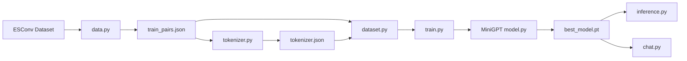

<div align="center">

# Emotional Support MiniGPT


<br />


<br />
<br />

> A compact GPT-style language model trained to generate supportive responses for emotional-support conversations.

</div>

---

## Project Vision

**Emotional Support MiniGPT** is the first version of a custom MiniGPT model focused on supportive conversation generation. It learns from counselor-style conversations, follows emotional-support structure, and generates new assistant replies from emotion, problem, strategy, and user-message context.

This is not just a chatbot script. It is a full mini language-model pipeline:

```text
Dataset -> Tokenizer -> MiniGPT Model -> Training -> Inference -> Interactive Chat
```

---

## V1 Performance Dashboard

<div align="center">

| Evaluation Aspect | Score | Progress |
| --- | ---: | --- |
| Learns emotional support | 7/10 | ███████░░░ |
| Learns conversation structure | 7/10 | ███████░░░ |
| Generates new text | 9/10 | █████████░ |
| English fluency | 5/10 | █████░░░░░ |
| Coherence | 6/10 | ██████░░░░ |
| Overall V1 | 7/10 | ███████░░░ |

</div>

<div align="center">

### Final V1 Accuracy: `75%`


</div>

---

## Highlights

| Feature | Description |
| --- | --- |
| Custom MiniGPT | Decoder-only GPT-style transformer implemented in PyTorch |
| Emotional Dataset | Training pairs prepared from ESConv emotional-support conversations |
| BPE Tokenizer | Custom tokenizer trained on the support-conversation corpus |
| Prompt Masking | Loss is calculated only on assistant response tokens |
| Smart Sampling | Uses temperature, top-k sampling, and repetition penalty |
| Checkpointing | Saves every epoch and tracks the best model |
| Chat Mode | Interactive terminal chatbot for real-time testing |

---

## Architecture

<div align="center">



</div>

## Model Configuration

| Component | Value |
| --- | --- |
| Vocabulary size | `8,000` |
| Hidden size | `256` |
| Attention heads | `8` |
| Decoder layers | `6` |
| Maximum sequence length | `512` |
| Training context length | `128` |
| Optimizer | `AdamW` |
| Learning rate | `3e-4` |
| Epochs | `5` |

---

## Project Structure

```text
emotional-support/
├── chat.py                 # Interactive terminal chatbot
├── data.py                 # Builds training pairs from ESConv
├── dataset.py              # PyTorch dataset with prompt/label masking
├── inference.py            # Single-prompt generation demo
├── model.py                # MiniGPT transformer architecture
├── tokenizer.py            # Trains and saves the BPE tokenizer
├── tokenizer.json          # Trained tokenizer file
├── requirements.txt        # Python dependencies
├── data/
│   ├── train_pairs.json    # Prompt/target training samples
│   ├── tokenizer_corpus.txt
│   └── corpus.txt
├── checkpoints/            # Current model checkpoints
└── checkpoints_v1/         # Earlier V1 checkpoint set
```

---

## Quick Start

Clone the repository:

```bash
git clone https://github.com/MaheshReddy-ML/MiniGPT-Emotional-Support
cd MiniGPT-Emotional-Support
```

Install dependencies:

```bash
pip install -r requirements.txt
```

Prepare the dataset:

```bash
python data.py
```

Train the tokenizer:

```bash
python tokenizer.py
```

Train the model:

```bash
python train.py
```

Run single-prompt inference:

```bash
python inference.py
```

Start interactive chat:

```bash
python chat.py
```

> On Apple Silicon, the scripts automatically use `mps` when available. Otherwise, they fall back to CPU.

---

## Example Chat Flow

```text
Emotion: anxiety
Problem: job crisis

Chat Started
Type 'quit' to exit

You: I am afraid I might lose my job.
Bot: I understand how stressful that can feel. It sounds like you are carrying a lot of worry right now.
```

---

## What Makes V1 Strong

<details open>
<summary><strong>Emotional-support behavior</strong></summary>

The model learns to generate gentle, validating, supportive responses. It can follow prompt sections like `Emotion`, `Problem`, `Strategy`, `User`, and `Assistant`.

</details>

<details open>
<summary><strong>Conversation structure</strong></summary>

The model understands the pattern of a support conversation and can continue from a structured emotional context.

</details>

<details open>
<summary><strong>New text generation</strong></summary>

V1 performs especially well at creating new responses instead of only copying training examples.

</details>

---

## Current Limitations

| Limitation | Why It Matters |
| --- | --- |
| English fluency needs work | Some generated replies may sound grammatically weak |
| Coherence can drift | Longer outputs may lose focus |
| Repetition can appear | Small models often repeat words or phrases |
| No crisis safety system | It should not be used for real mental-health emergencies |

---

## V2 Roadmap

```text
[x] Build MiniGPT V1
[x] Train tokenizer
[x] Train emotional-support model
[x] Add inference and chat scripts
[ ] Add validation split
[ ] Improve dataset cleaning
[ ] Add safer crisis-response handling
[ ] Tune sampling settings
[ ] Train for stronger fluency
[ ] Build a small web demo
```

## Best Next Improvements

| Priority | Upgrade | Expected Impact |
| ---: | --- | --- |
| 1 | Better dataset cleaning | Higher fluency and fewer awkward replies |
| 2 | Validation loss tracking | Better model selection |
| 3 | Crisis fallback detection | Safer support behavior |
| 4 | More training experiments | Better coherence |
| 5 | Web UI | Stronger demo presentation |

---

## Responsible Use

This project is for learning, experimentation, and portfolio demonstration. It should not be used as a replacement for therapy, crisis support, medical advice, or professional mental-health care.

---

<div align="center">

## Final Status

| Version | Accuracy | Overall Score | Main V2 Goal |
| --- | ---: | ---: | --- |
| V1 | `75%` | `7/10` | Improve fluency and coherence |

<br />


</div>
